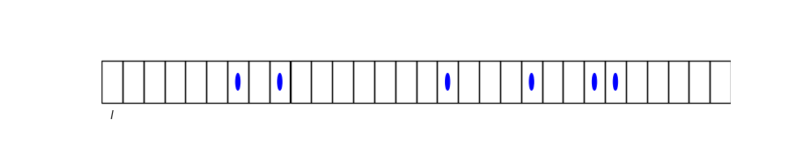

## Chemical reactions

To illustrate the conversion of free energy into work, we now discuss the equilibria aspired by chemical reactions. We then discuss ATP phosphorylation as an important reaction that is kept out of equilibrium in living systems, so that the drive towards equilibrium can be used inside biological cells to do work.  

### Dilute mixtures

The analysis of chemical reactions is only simple if one can assume that the relevant reactants are relatively dilute. For this case, we first need to analyze the chemical potential of dilute mixtures.

Let's divide up our entire space into cells of size $l^3$, such that, to a good approximation, each box contains 0 or $1$ solutes (but not more).

Let $z_{l} \equiv$ be the partition function of a cell with a solute and $z_{0}=$ the partition function of a cell without solute.

The total partition function is then given by

$$
\begin{aligned}
Z & =\frac{M^{N}}{N !} z_{l}^{N} z_{0}^{M-N}= \\
& =\frac{M^{N}}{N !}\left(\frac{z_{l}}{z_{0}}\right)^{N} z_{0}^{M} 
\end{aligned}
$$

where we assumed that the number $N$ of filled cells is much less than the total number $M$ of cells to simplify the combinatorial factor (binomial coefficient).

So, the chemical potential of the solutes is given by

$$
\beta \mu =-\left.\frac{\partial \ln Z}{\partial N}\right|_{T_{1} N}=-\ln \left(\frac{M}{N}\right)-\ln \left(\frac{z_{l}}{z_{0}}\right)
$$

or

$$
\mu=\underbrace{k_{\text{B}} T \ln \left(\rho \ell^{3}\right)}_{\text{conc. dep. of ideal gas}}+\underbrace{\mu^{(o)}}_{k_B T  \ln \left(\frac{z_{0}}{z_{l}}\right)}
$$ (chem-pot-dilute)

### Chemical equilibrium

Consider the simple chemical reaction

$$
b B \rightleftharpoons c C
$$ (chem-react)

where $b, c$ are stoichometric coefficients.

In equilibrium, the free energy $F\left(T, N_{B}, N_{C}\right)$ is minimal. $\Rightarrow$ Running {eq}`chem-react` in either direction should not change
the free energy $F$. So, imagine running {eq}`chem-react` once in the forward direction such that

$$
N_{B} \rightarrow N_{B}-b  \;,\qquad N_{C} \rightarrow N_{C}+c 
$$

then the free energy change is given by

$$
\Delta F=\left.\frac{\partial F}{\partial N_B}\right|_{T, p, N_{C}}(-b \Delta N)+\left(\frac{\partial F}{\partial N_{C}}\right)_{T, p, N_B}(c \Delta N)
$$

$$
\Delta F=\mu_{B}(-b \Delta N)+\mu_{B}(c \Delta N)\;.
$$ (free-energy-change-chem)

This free energy change has to vanish in equilibrium, implying 

$$
 \quad b \cdot \mu_{B}=c \cdot \mu_{c} .
$$

In dilute conditions, this equation turns into the law of mass action,

$$
b\left(k_{B} T \ln\left(\rho_{B} l^{3}\right)+\mu_{B}^{(0)}\right)=c\left(k_{B} T  \ln \left(\rho_{c} l^{3}\right)+\mu_{c}^{(0)}\right) 
$$

$$
\frac{\rho_{B}^{b}}{\rho_{C}^{c}}=\left(l^{-b+c}\right)^{3} e^{-\beta \Delta \mu_{\text{rxn}}^{(0)}}=K_{e q}(T) 
$$

$$
\Delta \mu_{\text{rxn}}^{(0)}=b \mu_{b}^{(0)}-c \mu_{c}^{(0)} \;,
$$

defining the equilibrium constant in terms of chemical potential differences.

Note, if a chemical reaction is not in equilibrium, it will run such that that $\Delta F <0$. If the reaction is
used to do work, we have

$$
W \geqslant \Delta F
$$

(W=work done on system) according to the second law, or the Jarzynski equality

$$
\langle\exp(-\beta W)\rangle = \exp(-\beta \Delta F) \;.
$$

#### Example: ATP consumption

Many cellular processes are powered by ATP hydrolysis

$$
A T P + H_2 O\leftrightarrows A D P+P_i
$$ 

transforming adenosine triphosphate (ATP) into adenosine diphosphate (ADP) and inorganic phosphate ($P_i$).

The ATP to ADP ratio is carefully [controlled](https://book.bionumbers.org/how-much-energy-is-released-in-atp-hydrolysis/) inside cells to tune via Eq.s {eq}`free-energy-change-chem` and {eq}`chem-pot-dilute` the free energy difference $\Delta F_{A T P\rightarrow ADP+P_i} $ released when ATP is hydrolyzed. For most cell types, $\Delta F\approx 20k_B T$, and the highest value, $30 k_BT$, in muscle cells of human athletes. 

Molecular motors are a good example of 
an engine that converts the free energy stored in ATP into mechanical work. 

Kinesin is a molecular motor that walks hand over hand in $\Delta r= 8$nm steps along biomolecules (Mictrotubules) to transport cargo faster than diffusion could.

The Block team at Stanford measured how fast these molecular motors can walk under a precisely tuned force load, set by optical tweezers. As they increased the load, the walking speed went down and dropped to 0 at the so-called stall force, which depends on the free energy difference associated with ATP hydrolysis. 

If the free energy difference is converted into work via a reversible process, we expect the stall force to be 

$$
f=\frac{\Delta F}{\Delta r} \approx 10 pN
$$

for $\Delta F=20 k_BT$. The Block team measured about $5-7$pN (Visscher, Schnitzel, Block Nature, 1999). It's interesting that the cell dissipates half the available free energy. Why did evolution not make these molecular motors more efficient? A plausible hypothesis is that live **needs** to dissipate energy to run deterministically / irreversibly.

