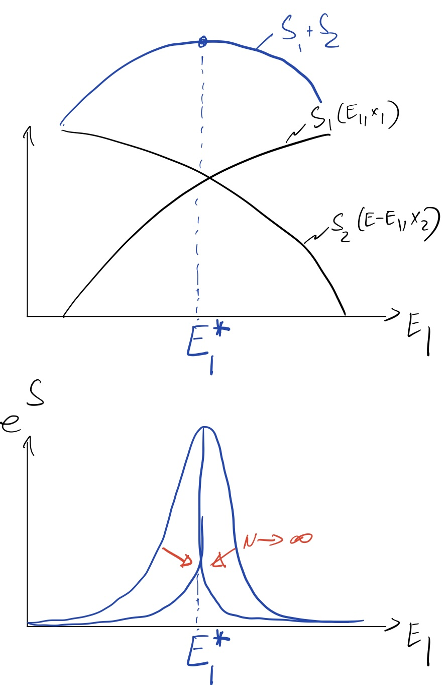

Principles of classical statistical mechanics Vardar Ch. 4

Note: We skipped

- Ch I an thermos: pare requisite - ch 3 on kin theory some of
this comes later

Today: - Max Ext principle in stat mech.

- thermal "equilibrium"

$\sigma \frac{1}{T} \equiv \frac{\partial S}{\partial E}$

- spotaneons reactions
- gen. coordinates and work

Classical Statistical Mechanics

equilibrium

- Basic principle: Jun an isolated system, all allowed (sec" érgaokicity hypothesis" "n Wiki"

microstates are equally likely.

$$
\leftrightarrow \text { Max EnTropy! }
$$

$\left(\vec{q}_{1}, \ldots \vec{a}_{N}\right)$

Let $\mu=\{q, p\}$ a point in $6 \mathrm{ND}$ dim. ph. space: $\left(\vec{p}_{1}, \ldots p_{N}\right)$

$$
P_{E}(\mu) d \mu \equiv \frac{1}{\Omega(E)} \delta(E-H(\mu)) d \mu
$$

micro-canouical ensemble

where $\Omega(E) \equiv \int d \mu \delta(E-H(\mu))$ is the density of microstates consistent with $H=E$
$\left(" D .0 . S^e{\text {s }}\right.$ )

insulation

N.B.: - if states are discrete, esq. for Is ing spins $\sigma_{i}= \pm 1, \int d \mu \rightarrow \sum_{\mu}$

$$
\delta(E-H(u)) \rightarrow \delta_{E_{1} H}
$$

- Postulate implies

$$
\begin{aligned}
\langle f\rangle_{E} & =\lim _{T \rightarrow \infty} \frac{1}{T} \int_{0}^{T} f(\mu(t)) d t \\
& =\int d \mu P_{E}(\mu) f(\mu) .
\end{aligned}
$$

Longtime average $\rightarrow$ ensemble

The celebrated ergadicity theorem explains why ( $x$ ) is to be expected for Hamiltonian dynamics. (later)

But we can also argue for (*) to be the most un biased (Max End) dist. subject to $H=E=$ canst

Recall: entropy of a prob. dist: is $S=-\sum_{i} P_{i} \ln \left(P_{i}\right)$, which is maximized for $P_{i}=$ canst $=\frac{1}{\Omega(E)}$ In that case, $S=\ln (\Omega)$.

Historically, Boltzmann defined $S \equiv k_{B} \ln (2)$ with $\left[k_{B}\right]=J / k$ a historical con venation.

N.1.: - Do continuous state space$\Omega$ is dimension fol.

$$
[\Omega]=([p][q])^{3 N} \cdot[E]^{-1} .
$$

- to obtain a sensible difinition of $S$, we should define

$$
S=k_{B} \ln \left(\frac{\Omega}{[\Omega]}\right) .
$$

- However, only differences $S\left(E_{1}\right)-S\left(E_{2}\right)$ matter in classical stat mech $\rightarrow \Delta S=k_{B} \ln \left(\frac{\Omega_{1}}{\Omega_{2}}\right)$ is coll-defined.
- $Q M \Rightarrow$ units of $[p] \cdot[q]=h$. well-defined.

Thermal equilibrium

Consider is cleared system $\{\mu, E\}$ consisting of tiro subsystems

$E_{1}, \underline{x}_{1}$

$\mu=\mu_{1} \otimes \mu_{2} \quad E=E_{1}+E_{2}+$ supple confide.

NB:

- $E_{1}, E_{2}$ care exferisive $(\alpha \|, V)$
- sunfucce contrib_ does not grow wt system size if inter actions are local $\rightarrow$ negligible as $N / t \rightarrow \infty$

$$
\begin{aligned}
\Rightarrow & P_{E}(\mu)=\frac{1}{\Omega(E)} \delta(E-H(\mu)) \\
& H(\mu)=H_{1}\left(\mu_{1}\right)+H_{2}\left(\mu_{2}\right)+\text { h. at. }
\end{aligned}
$$

$$
\begin{aligned}
\Omega(E) & =\int d \mu_{1} d \mu_{2} \delta(E-H(\mu)) \\
& =\int d E_{1} \Omega_{1}\left(E_{1}\right) \Omega_{2}\left(E-E_{1}\right) \\
e^{S(E) / k_{B}} & =\int d E_{1} e^{\left[S_{1}\left(E_{1}\right)+S\left(E-E_{1}\right)\right] / k_{B}}
\end{aligned}
$$

$S_{1}, S_{2}$ extensive:

$$
S(E)=N s_{1}\left(\frac{E_{1}}{N}\right)+N s_{2}\left(\frac{E-E_{1}}{N}\right)
$$

$\Rightarrow$ as $N \rightarrow \infty$

$\Delta$ deminated boy.meximum of inbeprond, i.e.

$$
S(E) \approx S_{1}\left(E_{1}^{*}\right)+S_{2}\left(E_{2}^{*}=E-E_{1}\right)
$$

where

$$
\begin{aligned}
0 & \left.\left.=\frac{d}{d E_{1}} \right\rvert\, \int_{E_{1}^{x}} S_{1}\left(E_{1}\right)+S_{2}\left(E-E_{1}\right)\right]= \\
& =\left.\frac{d S_{1}}{d E_{E_{1}}}\right|_{E_{1}^{x}}-\left.\frac{d S_{2}}{d E_{2}}\right|_{E_{2}^{x}=E-E_{1}}
\end{aligned}
$$

Defining $\frac{1}{T}=\frac{d S}{d E}, E^{*}$ is set by

$$
\frac{1}{T_{1}}=\frac{1}{T_{2}}
$$

$\Rightarrow$ we identify $T=\frac{d E}{d S}$ as the teu perature

Noto: $t$ adjucts itself so as to maximize $S$.

If we prepare initial cond. where $E_{i} \neq E_{1}^{N}$, by ergedicity $E_{i} \rightarrow E_{i}^{*}$ at long fime banse $E_{i}^{*}$ is mula more likely.

$$
\Delta S=S_{1}^{\prime}\left(E_{1}^{*}\right)+S_{2}\left(E_{2}^{*}\right)-S\left(E_{1}\right)-S\left(E_{2}\right) \geq 0
$$

To first arder in $E_{1}^{*}-E_{1}=\delta E_{1}$

$$
\left(\frac{1}{T_{1}}-\frac{1}{T_{2}}\right) \delta E_{1} \geqslant 0
$$

$\Rightarrow$ Everyy flews form hat $\rightarrow$ cald.

Stability: Since the point $\left(E_{1}^{*} E_{2}^{*}\right)$ is a maximum of $S\left(E_{1}^{*}\right)+S_{2}\left(E-E_{1}^{*}\right)$ we must have

$$
\left.\frac{\partial^{2} S_{1}}{\partial E^{2}}\right|_{x_{1}}+\left.\frac{\partial^{2} S_{2}}{\partial E_{2}^{2}}\right|_{x_{2}} \leq 0
$$

Suppose both systems are identical, $S_{1}=S_{2}$

$$
\left.\Rightarrow \partial_{t}^{2} S\right|_{x} \leq 0 \Rightarrow \text { S is concave }
$$

Also, since $\left.\partial_{E} S\right|_{x}=T^{-1}$, we have $\left.\frac{\partial E}{\partial T}\right|_{x} \geq 0$.

specific heat $C_{x} \geqslant 0$

Manipulating therma dyn. coordinets e.y.

$$
: \underline{x} \rightarrow \underline{x}+\underline{\delta x}
$$

$$
\text { reversibly }
$$

change in $E: E \rightarrow E+f \cdot \partial \underline{x}$

$$
\begin{aligned}
\delta S= & S\left(E+f \cdot \frac{d x}{x}, \underline{x}+\underline{\partial x}\right)- \\
& -S(E, \underline{x})= \\
= & \left.\frac{\partial S}{\partial t}\right|_{x}\left(\underline{f}(\underline{d x})+\left.\frac{\partial S}{\partial x}\right|_{E} \delta x \geq 0\right.
\end{aligned}
$$

$$
\text { én inilitar }
$$

revesilde $\rightarrow "=0$.

$$
\left.\Rightarrow \frac{\partial S}{\partial x_{1}}\right|_{E_{1} x_{j+i}}=-\frac{J_{i}}{T}
$$

$$
\begin{gathered}
\Rightarrow d S(E, x)=\frac{d E}{T}-\frac{F \frac{d x}{T}}{T} \\
\Rightarrow \underbrace{T d S}_{d Q}+J d x
\end{gathered}
$$

Hent.

Glass of water, Biological cells, e tc. are open systems

$\Rightarrow$ trade $E, V, N$ with environment

(ak. a reservoir

