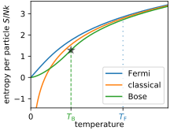

### Gibbs entropy / Partition Function / Free energy

We alluded to intuition that, in large systems, the product of microstates and Boltzmann factor is strongly peaked. The typical states of a large system lie on the peak, where Helmholtz free energy $F=E_{S}-T_{R} S_{S}$ is minimized. But in fact, we can easily show that $F$ is minimized even in small systems if we define the entropy as Gibbs entropy

$$
S_{S} \equiv-k_{B}\langle\ln P\rangle=-k_{B} \sum_{\mu_S} P(\mu_S) \ln P(\mu_S) \;.
$$(Gibbs-Entropy)

To that end, recall from our [discussion of information entropy](max-ent-boltzmann) that Boltzmann distribution is the maximum entropy distribution given the mean energy $\left\langle E_{S}\right\rangle$. Thus, Boltzmann distribution maximizes the function

$$
\Phi=S_{S}-T_{R}^{-1}\left\langle \mathcal{H}_{S}\right\rangle=\frac{F}{T} \;,
$$

where $T_{R}^{-1}$ is a Lagrange multiplier, only subject to the normalization constraint $\sum_i p_i=1$.


##### So, let's compute the Gibbs entropy:
The Gibbs entropy depends on the probability distribution over micro-states,

$$
P\left(\mu_{S}\right)=\frac{e^{-\beta_{R} \mathcal{H}(\mu_{S})}}{Z}\;,
$$

which consists of the Boltzmann factor, and the normalization factor 

$$
Z=\sum_{\mu_{S}} e^{-\beta_{R} \mathcal{H}(\mu_{S})} = \sum_{E_{S}} \Omega_S\left(E_{S}\right) e^{-\beta_{R} E_{S}}\;,
$$

which is called the **partition function**.

The Gibbs entropy thus evalutes to 

$$
\begin{aligned}
S_{S} &=-k_{B}\langle\ln P\rangle=-k_{B}\sum_\mu P(\mu)\ln P(\mu)\\
&-k_{B}\sum_\mu P(\mu)\ln\left(\frac{\exp(-\beta_R \mathcal{H}_S(\mu))}{Z}\right)=+\frac{\langle\mathcal{H}_{S}\rangle}{T_{R}}+k_{B} \ln (Z)
\end{aligned}
$$

or 

$$\boxed{-k_{B} T \ln (Z)=\langle\mathcal{H}_S\rangle-T_{R} S_{S}=F(T_R,\mathbf{x})}$$  

The fact that the free energy is given by the log of the partition function explains why the partition function is such an important object. The above relationship also implies that the canonical distribution can be written as

$$
P\left(\mu_{S}\right)=\frac{e^{-\beta_{R} \mathcal{H}(\mu_{S})}}{Z} = e^{-\beta_{R} (\mathcal{H}\left(\mu_{S})-F\right)}\;.
$$

So, the probability of observing a microstate is exponential in the difference betwen micro-state energy and free energy - usefuly and easy to remember.


```{admonition} Quick Math Recap
We will next discuss some mathematical properties of the partition function. As a warmup, let's recall the definition of *moment generating function*

$$
\tilde{p}(t) \equiv \sum p(x) e^{t x} \;,
$$

which satisfies 

$$\left.\partial_{t}^{n} \tilde{p}(t)\right|_{t=0}=\left\langle x^{n}\right\rangle$$

The Taylor expansion of the *cumulant generating function* $\ln \tilde p(t)$ yields the connected moments $\langle \rangle_c$,

$$\boxed{\left.\partial_{t}^{n} \ln\tilde{p}(t)\right|_{t=0}=\left\langle x^{n}\right\rangle_{\text{c}}} \qquad (*)$$

which are also called cumulants in probability theory. The first cumulants are mean, variance, skew and curtosis. A Gaussian has an infinite series of moments, but only the first two cumulants are non-vanishing. That's why cumulants are generally more useful than moments.

$$\langle x\rangle_c=\text{mean}(x)=\langle x\rangle$$

$$
 \left\langle x^{2}\right\rangle_{c}=\operatorname{var}(x)=\left\langle x^{2}-(x)\right\rangle^{2} 
$$

If $p(x)$ is normalized, $\tilde{p}(0)=1$, so

$$
\ln \tilde{p}(t)=0+\langle x\rangle t+\frac{1}{2}\left\langle x^{2}\right\rangle_{c} t^{2}+\ldots
$$

If is not normalized, with $ \sum_{x} p(x)=Z_0$,

$$
\ln (\tilde{p}(t))=-\ln (Z_0)+\langle x\rangle_c t+\frac{1}{2}\langle x\rangle_{c}^{2} t^{2}+\ldots
$$

$\Rightarrow$ **(*) still holds!**
```


#### Properties of the Partition Function

The first thing to note about the partition function 

$$
Z(\beta) \equiv \sum_{E_{S}} \Omega\left(E_{S}\right) e^{-\beta E_{S}}
$$

is that it is the [Laplace transform](https://en.wikipedia.org/wiki/Laplace_transform) of $\Omega\left(E_{S}\right)$. Since Laplace transforms can be inverted, $Z(\beta)$ and $\Omega(E)$ contain the same information. Likewise, their logarithms, the free energy $F$ and the entropy $S$, contain the same information.

Moreover, $Z(\beta)$ can be viewed as the unnormalized moment generating function of the microcanonical distribution (with $t=-\beta$). Therefore, we can obtain cumulants of the internal energy by taking derivatives of the log of $Z$ (see Quick Math Recap)

$$\langle E\rangle =-\partial_\beta \ln(Z(\beta))$$


Check:

$$
\begin{aligned}
 & -\partial_{\beta} \ln [Z(\beta)]=\frac{-\partial_\beta Z(\beta)}{Z(\beta)}=\frac{\sum_{i}\left(-\partial_{\beta}\right) e^{-\beta E_{i}}}{Z(\beta)} \\
= & \frac{\sum_{i} E_{i} e^{-\beta E_{i}}}{\sum_{i} e^{-\beta E_{i}}}=\langle E\rangle
\end{aligned}
$$

$$\text{var}( E) =(-\partial_\beta)^2 \ln(Z(\beta))=-\partial_\beta \langle E\rangle=k_\text{B} T^2\frac{\partial\langle E\rangle}{\partial T}= k_\text{B} T^2 C_x$$


**Note:** 
- $C_{x}=\frac{1}{k_{B} T^{2}}\left\langle\delta E^{2}\right\rangle$. This is our first encounter of a fluctuation-response relationship (also called fluctuation-dissipation relationship): Fluctuations quite generally probe the system's potential to (linearly) respond to external forces.
- These relationships are super useful for experiments: We can measure how a polymer responds to a pulling force just by watching the polymer fluctuate, importantly without applying any force ourselves.


- The ratio of mean squared energy fluctuations and mean internal energy quantifies the concentration of measure in the thermodynamic limit: $\frac{\left\langle \delta E^{2}\right\rangle}{\langle E\rangle}=\sqrt{k_{B} T^{2}} \frac{\sqrt{C_{x}}}{\langle E\rangle} \sim N^{-1 / 2} $ because both $C_{x}\propto N$ and $E\propto N$ are extensive. 

- The concentration of measure implies that canonical and microcanonical ensembles are equivalent in the thermodynamic limit. (But they are not equivalent for small systems!)


#### Applications: N particles in a box

(i) **Maxwell--Boltzmann distribution**

$$
\begin{aligned}
& H(\{q, q\})=\sum_{i} \frac{\vec{p}_{1}^{2}}{k m}+U(\{q\}) \\
& P(\{q, p\})=Z^{-1}\left(\prod_{i} e^{-\frac{\vec{p}_{i}^{2}}{2 m}}\right) e^{-\beta U(\xi q\}\}}
\end{aligned}
$$

Distribution over each $p_i$ factorizes, with the marginal

$$
P\left(p_{i}\right)=\frac{e^{-\beta p_{i}^{2} / 2 m}}{\sqrt{2 \pi m / \beta}}
$$

**Ideal gas** 

$$U=\left\{\begin{array}{l}0, \text{if all }\vec{q}_{i} \in \text{box} \\ \infty, \text { otherwise. }\end{array}\right.$$

The partition function evaluates to

$$
\begin{aligned}
Z & =\int \frac{d \vec{p}_{i} d \vec{q}_{i}}{h N !} e^{-\beta p_{i}^{2} / 2 m-U} \\
& =\frac{1}{N !}\left(\frac{V}{\lambda^{3}}\right)^{N} 
\end{aligned}
$$

where we introduced the characteristic length scale 

$$
\lambda=\frac{h}{\sqrt{2 \pi m k_{\beta} T}}
$$

associated with Planck's constant. Note that we introduced the factor $1/N!$ accounting for the fact that $N!$ configurations obtained by relabelling indices belong to the same microstate. 

The free energy $F=-k_\text{B}T \ln(Z)$ is obtained from the log of the partition function,

$$
\begin{aligned}
& \frac{F}{k_{B} T}=-N \ln \left(\frac{V}{\lambda^{3}}\right)+N(\ln N-1) \\
& =-N\left[\ln \left(\frac{V / N}{\lambda^{3}}\right)-1\right] \\
& \frac{F}{K_{B} T}=-N \ln \left(\frac{V e}{N \lambda^{3}}\right) . 
\end{aligned}
$$

Note that the free energy is extensive. If we hadn't incorporated the combinatorial factor $1/N!$, we would have obtained a super-extensive free energy (scaling as $N\log N$). This non-extensivity of the naive free energy (without $N!$) is called the [Gibbs paradox](https://en.wikipedia.org/wiki/Gibbs_paradox).

To obtain from the free energy all the usual ideal gas laws, we use

$$
d F=d(E-TS)=-S d T-\underbrace{\mu d N -P d V}_{J \cdot d x}\;.
$$


$$
\begin{aligned}
& P=\left.\frac{-\partial F}{\partial V}\right|_{T, N}=\frac{N k_{B} T}{V} \\
& \mu=\left.\frac{\partial F}{\partial N}\right|_{T, V}=\frac{F}{N}+k_{B} T=k_{B} T \ln \left(\frac{N}{V} \lambda^{3}\right) \\
& -S=\left.\frac{\partial F}{\partial T}\right|_{V, N}=\frac{F}{T}-N k_{B} T \cdot \frac{3}{2} \frac{1}{T} \\
& \frac{S}{N k_{B}}= \ln \left(\frac{V}{N \lambda^{3}}\right)+\frac{5}{2} 
\end{aligned}
$$

where the expression for the ideal gas entropy is called [Sackur-Tetrode formula](https://en.wikipedia.org/wiki/Sackur–Tetrode_equation). For this expression to be a good approximation, we have to require that the volume per particle is much larger than $\lambda^3$,

$$ \frac{V}{N} \gg \lambda^3 \;.$$

Multiple particles trying to occupy the same "voxel" $\lambda^3$ will interact quantum mechanically. The onset of quantum mechanical effects can be seen in a graph comparing the entropy of a classical, Bose and Fermi gas (Figure from Wikipedia)



 
