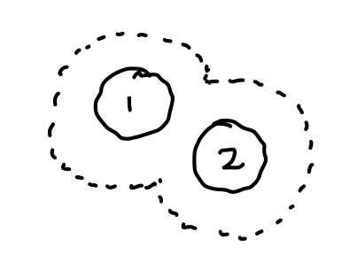
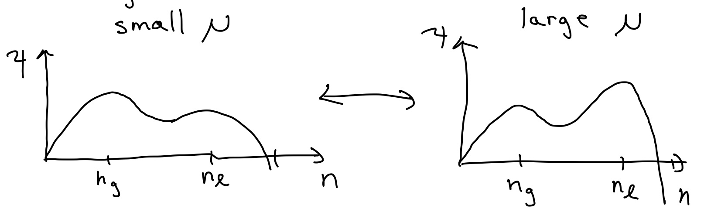
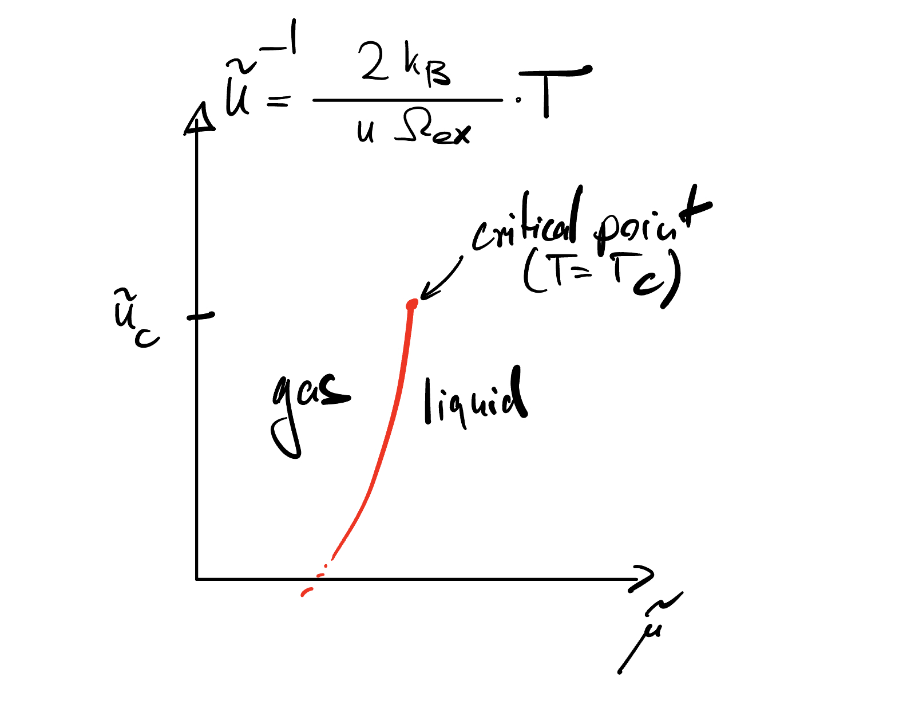
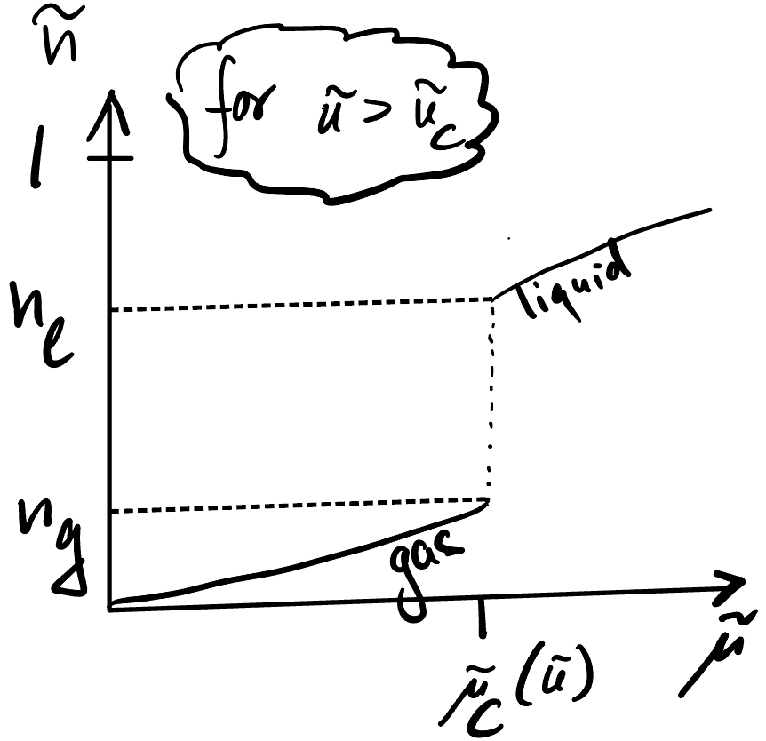
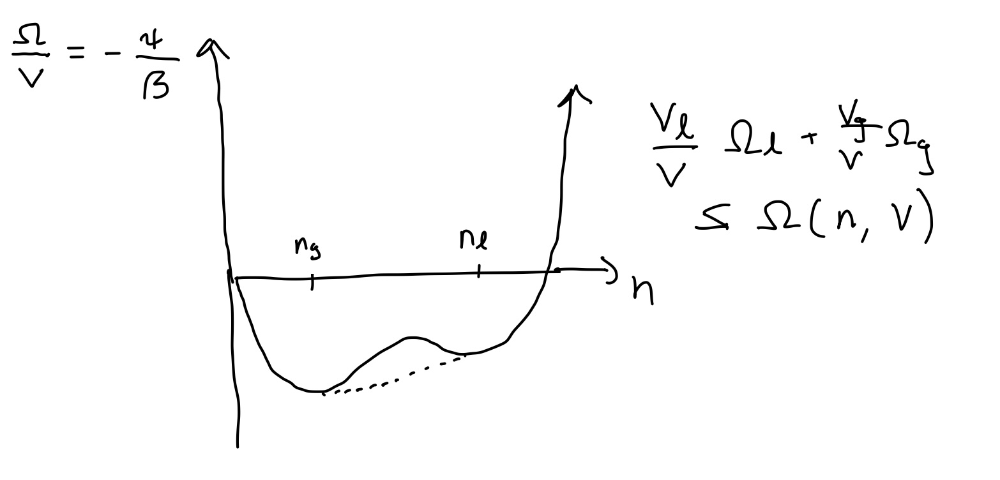

## Interacting Gases

Let's return to the Hamiltonian of particles - now with interactions, 

$$
\begin{equation*}
\mathcal{H}_{N}=\sum_{i=1}^{N} \frac{\vec{p}_{i}^{2}}{2 m}+\mathcal{U}\left(\vec{q}_{1}, \cdots, \vec{q}_{N}\right) 
\end{equation*}
$$

the partition function can be written as

$$
\begin{align*}
Z(T, V, N) & =\frac{1}{N !} \int \prod_{i=1}^{N}\left(\frac{\mathrm{d}^{D} \vec{p}_{i} \mathrm{~d}^{D} \vec{q}_{i}}{h^{D}}\right) \exp \left[-\beta \sum_{i} \frac{\vec{p}_{i}{ }^{2}}{2 m}\right] \exp \left[-\beta \mathcal{U}\left(\vec{q}_{1}, \cdots, \vec{q}_{N}\right)\right] \\
& =Z_{0}(T, V, N) \langle \exp \left[-\beta \mathcal{U}\left(\vec{q}_{1}, \cdots, \vec{q}_{N}\right)\right]\rangle^{0}
\end{align*}
$$

where 

$$Z_{0}(T, V, N)=\frac{V^N}{N!\lambda^{DN}}\\
\lambda=\sqrt{\frac{2\pi h^2}{k_B T m}}
$$

is the partition function of the ideal gas (Eq. (4.73)), and $\langle\mathcal{O}\rangle^{0}$ denotes the expectation value of $\mathcal{O}$ computed with the probability distribution of the non-interacting system. 

Without interactions, we have 

$$
\begin{aligned}
& F_0=-K_{B} T \ln (Z_0)=-K_{B} T N\ln \left(\frac{e V}{N\lambda^{D}}\right) \\
& P=-\left.\frac{\partial F}{\partial V}\right|_{N, T}=\frac{N K_{B} T}{V}, \quad P V=N K_{B} T
\end{aligned}
$$

But the "configuration integral" 

$$
\phi(T, V, N)\equiv \langle \exp \left[-\beta \mathcal{U}\left(\vec{q}_{1}, \cdots, \vec{q}_{N}\right)\right]\rangle^{0}=\left(\prod_{i=1}^{N} \int \frac{\mathrm{~d}^{3} \vec{q}_{i}}{V}\right)\exp \left[-\beta \mathcal{U}\left(\vec{q}_{1}, \cdots, \vec{q}_{N}\right)\right]
$$

can't be exactly computed in general. We need approximations: molecular dynamics(HW), monte carlo (soon),  perturbation theory in $N / V$ (Mayer Cluster expansion, see text), mean field theory, variational approximations (today). 

Before diving in, an exactly solvable warmup:

Gas of hard ID "spheres" (intervals) of "volume" (length) $\Omega$.
 (Tonk's gas)

Then

$$
\phi(T, V, N) = V^{-N}\int^{V-\Omega}_{(N-1)\Omega}dq_N\ldots\int_{2\Omega}^{q_4-\Omega}dq_3\int_{\Omega}^{q_3-\Omega}dq_2\int_{0}^{q_2-\Omega}dq_1\\
 = V^{-N}\int^{V-\Omega}_{(N-1)\Omega}dq_N\ldots\int_{2\Omega}^{q_4-\Omega}dq_3\int_{\Omega}^{q_3-\Omega}dq_2 (q_2-\Omega)\\
 = V^{-N}\int^{V-\Omega}_{(N-1)\Omega}dq_N\ldots\int_{2\Omega}^{q_4-\Omega}dq_3(q_3-2 \Omega)^2\\
 = V^{-N}\int^{V-\Omega}_{(N-1)\Omega}dq_N \left(q_N-(N-1) \Omega\right)^{N-1}\\
= \frac{(V-N\Omega)^N}{V^N}
$$

$$
Z(T,V,N)=Z_0 \phi(T, V, N)=\frac{(V-N\Omega)^N}{N!\lambda^{D N}}
$$

$$
\begin{aligned}
& F=-K_{B} T \ln (Z)=-K_{B} T N\ln \left(\frac{e (V-N\Omega)}{N\lambda^{D}}\right) \\
& P=-\left.\frac{\partial F}{\partial V}\right|_{N, T}=\frac{N K_{B} T}{(V-N\Omega)}, \quad P V=N K_{B} T
\end{aligned}
$$

$$
\ln(\phi(T, V, N)) = \sum_{k=1}^{N}\ln(1-\frac{k\Omega}{V})
$$

$$
\partial_V \ln(\phi(T, V, N)) = \sum_{k=1}^{N}\ln(1-\frac{k\Omega}{V})
$$

#### Excluded volume effect

The "excluded volume" effect extends more generally, but in approximate sense. For this discussion, it is convenient to introduce the excluded volume $\Omega_{ex}$ of a particle. Consider for example hard spheres. Then one sphere excludes all other sphere centers from a sphere of twice the radius, or volume $\Omega_{ex}=2^D\Omega$, i.e. larger than just the sphere itself. Naively, we would then approximate the configurational integral as

$$
\phi(T, V, N) \approx \frac{V}{V}  \cdot\frac{V-\Omega_{ex}}{V}\cdot\frac{V-2\Omega_{ex}}{V}\ldots \cdot\frac{V-(N-1)\Omega_{ex}}{V}
$$

This is approximate because of jamming ...

The excluded volume for particle 3 once 1,2 placed is not strictly additive if 1,2 are close: 3 has more space available when 1,2 are close than if they are apart (see [depletion force](https://en.wikipedia.org/wiki/Depletion_force)). 

But if $N \Omega_{ex} \ll V$, this interaction is rare, so approximation ok in dilute limit. So,

$$
\phi(T, V, N) \approx \prod_{n=1}^{N}(V-(N-n) \Omega_{ex})=e^{\sum \ln (V-(N-n) \Omega_{ex})} \\
 \approx e^{N \ln \left(V-\frac{N}{2} \Omega_{ex}\right)}+O\left(\left(\frac{N \Omega_{ex}}{V}\right)^{2}\right)
$$

So effectively $\quad V \longrightarrow V-N \Omega_{ex}/2$. 

$$
\begin{array}{r}
P\left(V-N \Omega_{ex}/2\right) \approx N K_{B} T \\
P=n K_{B} T \frac{1}{1-n \Omega_{ex}/2}
\end{array}
$$

Note that this result reproduces our exact result in one dimensions, where $\Omega_{ex}=2\Omega$.

$$
\begin{aligned}
P & =n K_{B} T \frac{1}{1-n \Omega_{ex}/2} \\
& =n K_{B}+\left(1+(\Omega_{ex}/2) n+\left(\Omega_{ex}/2\right)^{2} n^{2}+\cdots\right)
\end{aligned}
$$

This is an example of a "viral expansion"

$$
P=n K_{B} T\left(1+B_{2}(T) n+B_{3}(T) n^{2}+\cdots\right)
$$

As explained in the textbook, the $B_{n}(T)$ can be computed systematically via a diagrammatic perturbation theory. This Mayer Cluster Expansion is however rather technical and its applicability somewhat limited - so we won't discuss it in class. But have a look, especially if you're interested in QFT. Here's we'll focus on the variational treatment.

## Variational treatment of a gas and the van der Waals equation of state

Our approximate treatment of a hard-sphere gas took only the "excluded volume" repulsion

$$
V^{N} \rightarrow(V-\Omega_{ex}2^{D-1})^{N}
$$

But neutral molecules interact through an attractive $U(r) \approx-4 \epsilon\left(\frac{\sigma}{r}\right)^{6}$ as $r \rightarrow \infty$, with short-range repulsion. Why? The charged constituents of a molecule can polarize:

Since a dipole generates $E \propto \frac{d}{r^{3}}$, and $U\propto-\vec{E} \cdot \vec{d}$, i.e.

$$
U\propto \frac{d_{1} d_{2}}{r^{3}}
$$

We can then treat this in quantum perturbation theory for a rotationally-symmetric molecule. In ground state, $\langle\vec{d}\rangle=0$ so to first order $\Delta E=0$. If $\Delta=E_{1}-E_{0}$ is gap, and second order perturbation theory gives

$$
\Delta E=-\frac{|\langle 1|U| 0\rangle|^{2}}{\Delta}
$$

Since $U \sim \frac{d_{1} d_{2}}{r^{3}}, \quad \Delta E \sim-\frac{1}{r^{6}}$

The competition between attraction, repulsion, and entropy leads to the presence of complex phase diagrams:

### Mean-field treatment

$$
H=\sum_{i} \frac{\rho^{2}}{2 m}+\frac{1}{2} \sum_{i \neq j} U\left(r_{i}-r_{j}\right)
$$

$$
U(r)=\left\{\begin{array}{l}
\infty, \quad r<r_{0} \\
-u_{0}\left(\frac{r_{0}}{r}\right)^{6}, r>r_{0}
\end{array}\right.
$$

$$
\begin{aligned}
& Z(N, T, V)=\frac{1}{N ! \lambda_{T}^{3N}} \left(\prod_{k=1}^{N} \int_{V} d^{3} r_{k} \right) e^{-\frac{\beta}{2} \sum_{i\neq j} U\left(r_{i}-r_{j}\right)} \\
& Q(\mu, T, V)=\operatorname{Tr}\left(e^{-\beta(H-\mu N)}\right)=\sum_{N} e^{\beta \mu N} Z(N, T, V)
\end{aligned}
$$

We will see that the $Q$-ensemble is convenient: $\mu$ is like the "B" of Ising model, while the density $n=N/V$ jumps like $m$.

#### Variational ansatz:

$$
\rho_{N} \propto e^{-\beta \sum_{i=1}^{N} \frac{p^{2}}{2 m}} \text{ if }\left|r_{i}-r_{j}\right| > r_{0}
$$

where $N$ is our variational parameter.

If we treat the $\left|r_{i}-r_{j}\right|>r_{0}$ constraint via the low-$n$ excluded volume approximation,

$$
\begin{aligned}
Z(N, T, V) & =\frac{(V-N \Omega_{ex} / 2)^{N}}{N ! \lambda_{T}^{3 N}} \\
\ln \frac{1}{N !} & =e^{N\left[\ln \left(\frac{1}{N}\right)+1\right] \quad(\text {Stirling) }} \\
Z(N, T, V) & =e^{N\left[\ln \left(\frac{V / N-\Omega_{ex}/ 2}{\lambda^{3} T}\right)+1\right]} \\
Q(\mu, T, V) & =\sum_{N'} Z\left(N^{\prime}, T, V\right) e^{\beta N^{\prime} \mu}
\end{aligned}
$$

But by our ansatz, only $N^{\prime}=N$ contributes:

$$
Q_{N}(\mu, T, v)=e^{N\left[\ln \left(\frac{V / N-\Omega_{ex}/ 2}{\lambda^{3} T}\right)+\beta \mu+1\right] .}
$$

We can then apply the Gibbs inequality
 
$$
\begin{gathered}
\ln (Q) \geqslant \ln \left(Q_{N}\right)+\beta\left\langle H_{N}-H\right\rangle_{N} \\
H_{N}-H=-\frac{1}{2} \sum_{i \neq j}^{ N} U\left(r_{i}-r_{j}\right) \quad\left(\left|r_{i}-r_{j}\right|>r_{0}\right)
\end{gathered}
$$

Fortunately, is is easy to compute $\left\langle U\left(r_{i}-r_{j}\right)\right)_{N}$ because in $\langle\rangle_{N}$ particles are uncorrelated outside $r_{0}$ :

$$
\begin{aligned}
\left\langle U\left(r_{i}-r_{j}\right)\right\rangle_{N} & =\frac{\int_{r > r_{0}} d^D r\; U(r)}{V} \equiv & -\frac{u}{V} \\
{[u] } & =J \cdot m^{D} 
\end{aligned}
$$

For $U(r)=-U_{0}\left(\frac{r_{0}}{r}\right)^{\alpha}$ for example,

$$
S_{D} \int_{r_{0}}^{\infty} r^{D-1-\alpha} d r=\left.S_{D} \frac{r^{D-\alpha}}{D-\alpha}\right|_{r_{0}} ^{R}, \alpha>D
$$

$$
\begin{aligned}
u & =U_{0} r_{0}^{\alpha} S_{D}\left(\frac{0-r_{0}^{D-\alpha}}{D-\alpha}\right) \\
& =U_{0} \frac{S_{D}}{\alpha-D} r_{0}^{D}
\end{aligned}
$$

So

$$
\begin{aligned}
\left\langle\frac{1}{2} \sum_{i \neq j} U\left(r_{i}-r_{j}\right)\right\rangle & =-\frac{u}{V} \frac{N(N-1)}{2} \\
& =\frac{-u \cdot N^{2}}{V}=-u\frac{n}{2}  N \quad(N \rightarrow \infty)
\end{aligned}
$$

Simple physical interpretation: each particle sees $-u \cdot n$ on average from other particles (mean-field)

$$\left.\ln Q \geq \ln (Q_N)+\beta\langle H_{N}-H\right\rangle_{N}=$$

$$
\begin{aligned}
& =N\left[\ln \left(\frac{V / N-\Omega_{ex}/ 2}{\lambda^{3} T}\right)+\beta \mu+1\right]+\beta u \frac{n}{2} N 
\end{aligned}
$$

$$
 \frac{\ln Q}{V} \geq n\left[\ln \left(\frac{n^{-1}-\Omega_{ex}/ 2}{\lambda^{3} T}\right)+\beta \mu+1\right]+\beta u \frac{n^{2}}{2}\equiv\psi[n]
$$

Now maximize $\psi$ w.r.t. $n$ : depending on $\beta$ and $\mu$, it can be in two maxima corresponding to gas and liquid:

(add figure)

$$
\begin{aligned}
& \psi[n]=n\left[\ln \left(\frac{n^{-1}-\Omega_{ex}/ 2}{\lambda^{3} T}\right)+ \beta \mu+1\right]+\beta u \frac{n^{2}}{2} \\
& \beta P=\max _{n} \psi[n]
\end{aligned}
$$

Maximize:

$$
\partial_{n} \psi=\ln \left(\frac{n^{-1}-\Omega_{ex}/ 2}{\lambda^{3}}\right)+\beta \mu+1+\beta u n-\frac{1}{1-n \Omega_{ex}/ 2}
$$

$$
\beta \mu=-1-\beta u n-\ln \left(\frac{n^{-1}-n / 2}{\lambda^{3}}\right)+\frac{1}{1-n \Omega_{ex}/ 2}
$$

This can admit multiple solutions

substituting back into $\psi[n]$,

$$
\beta^{-1} \psi[n]=K_{B} T n \frac{1}{1-n \Omega_{ex}/ 2}-u n^{2} / 2 
$$

Note the free energy $\psi$ has a simple interpretation in terms of pressure:

$$
-\frac{1}{\beta} \ln Q=\Omega_{ex}E-T S-\mu N \\
 =(T S+\mu N-P V)-(T S+\mu N) \\
 =-P V
$$

So,

$$
\beta P \approx \max_{n} \psi[n]
$$

So, 

$$
\left(P+u n^{2} / 2\right)=K_{B} T \frac{N}{V-N \Omega_{ex}/ 2}
$$

which leads the **Van der Waals equation of state**:

$$
\begin{aligned}
& \left(P+u n^{2} / 2\right)(V-N \Omega_{ex}/ 2)=N K_{B} T \\
& \left(P+a n^{2}\right)(V-b N)=N K_{B} T \;.
\end{aligned}
$$

We see the two phenomenological coefficients $a$ and $b$ of VdW have their origin in the mean field treatment of long-range attraction (a) and short-distance repulsion (b).

In terms of the molecular volume $v=n^{-1}$, we can also write

$$
P=\frac{k_B T}{v-b}-\frac{a}{v^2}
$$

showing that effect of long-range interaction is to shift $P \rightarrow P-a n^2=P-a v^{-2}$ due to the average attraction $u n$ experienced by each particle (mean-field)

$$
\begin{aligned}
\partial_{n} \psi & =0 \\
\beta(\mu+u n) & =\ln \left(\frac{n \lambda^{3}}{1-n \Omega_{ex}/ 2}\right)+\frac{n \Omega_{ex}/ 2}{1-n \Omega_{ex}/ 2}
\end{aligned}
$$

Interpretation: effect of long-range interaction is to shift $\mu \rightarrow \mu+$ un do to the average attraction un experienced by each particle (mean-field)

$$
\psi=n\left[\ln \left(\frac{n^{-1}-\Omega_{ex}/ 2}{\lambda^{3} T}\right)+\beta \mu+1\right]+\beta u \frac{n^{2}}{2}
$$

Choose units with $\beta=1, \Omega_{ex}/ 2=1$, and shift $\mu$ :

$$
\psi=n \ln \left(n^{-1}-1\right)+u \frac{n^{2}}{2}+\left(\bar{\mu}+\frac{3}{2}-\frac{u}{3}-\ln 2\right) n
$$

Clearly two maxima $\longrightarrow 1$ minima. So need region

$$
\partial_{n}^{2} \psi=u-\frac{1}{n(1-n)^{2}} \geq 0
$$

Best case: $n=\frac{1}{3} \Rightarrow u \geq \frac{27}{4} \equiv u_{c}$

For $u>u_{c}, \quad \psi$ develops two maxima

at $n_{g}<n_{l}$

Below $T_{c}$,

#### Maxwell Construction / Coexistence

If we work in contact with particle reservoir ( $\mu$-ensemble), then $n(\mu)$ jumps below $T_{c}: n_{n g} \mathfrak{f}^{n} \longrightarrow_{N}$.

But what if we put $n=\frac{N}{V}$ particks in a box for fixed $N$ with $n_{g}<n<h_{l}$ ? Intuitively, we know: it will phase separate:

$$
\begin{aligned}
& V=V_{g}+V_{l} \\
& N=N_{g}+N_{l} \\
& N=n_{g} \cdot V_{g}+n_{l} V_{l} \\
& n=n_{g} \cdot \frac{V_{g}}{V}+n_{l} \frac{V_{l}}{V}
\end{aligned}
$$

